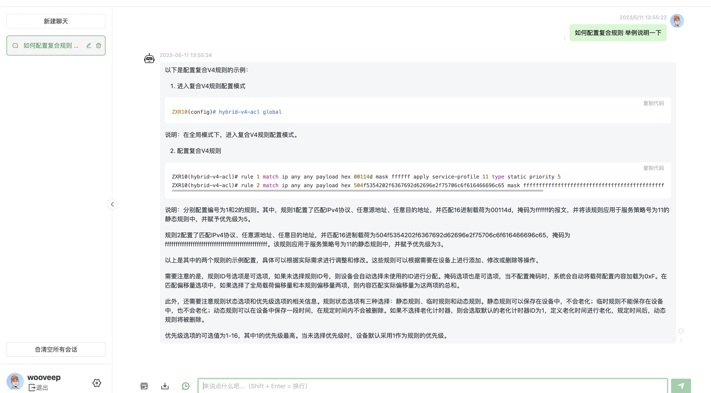

<!--
 * @Author: cloudyi.li
 * @Date: 2023-05-10 09:15:49
 * @LastEditTime: 2023-05-23 14:33:54
 * @LastEditors: cloudyi.li
 * @FilePath: /chatserver-api/README.md
-->

# 基于OPENAI的ChatGPT API开发的AI助手服务

本仓库为后端API服务，依赖的前端仓库为[wooveep](https://github.com/wooveep)/[chatserver-web](https://github.com/wooveep/chatserver-web)

- [基于OPENAI的ChatGPT API开发的AI助手服务](#基于openai的chatgpt-api开发的ai助手服务)
  - [实现功能](#实现功能)
  - [应用场景](#应用场景)
  - [目标群体](#目标群体)
  - [系统演示](#系统演示)
    - [项目截图](#项目截图)
      - [用户登录](#用户登录)
      - [用户注册](#用户注册)
      - [用户信息展示](#用户信息展示)
      - [会话上下文设置](#会话上下文设置)
      - [会话角色控制](#会话角色控制)
      - [基于本地知识库的问答](#基于本地知识库的问答)
  - [待实现列表](#待实现列表)
  - [安装部署](#安装部署)
    - [前置条件](#前置条件)
      - [部署安装带有pgvector插件的postgresql](#部署安装带有pgvector插件的postgresql)
        - [加载项目所需的库表](#加载项目所需的库表)
    - [编译项目方式运行](#编译项目方式运行)
      - [编译项目](#编译项目)
      - [配置config文件](#配置config文件)
      - [启动项目](#启动项目)
    - [使用Docker方式运行](#使用docker方式运行)
      - [自构建docker镜像](#自构建docker镜像)
      - [直接拉取仓库镜像](#直接拉取仓库镜像)
      - [编辑配置文件](#编辑配置文件)
      - [启动docker镜像](#启动docker镜像)
  - [引用的社区仓库代码](#引用的社区仓库代码)
  - [License](#license)

## 实现功能

- [x] 登录、注册、用户管理
- [x] 用户额度、会员有效期管理
- [x] 服务端保存用户会话和聊天记录
- [x] 会话AI角色管理
- [x] 长回复功能实现 <!--API返回消息因为TOKEN长度中断时自动处理-->
- [x] 支持结合本地知识库问答
- [x] 多会话储存和上下文逻辑
- [x] 支持流式回复打字机效果
- [x] 支持按照Token计费
- [x] 基于卡密方式的用户额度充值
- [x] 用户角色权限管理
- [x] 支持Azure API
- [x] 支持Azure内容过滤

## 应用场景

我们 的AI助手适用于以下场景：

- 企业用户：结合公开外发客户的产品手册，解答产品问题，优化客服成本。
- 保险行业：结合保险条款内容，解答客户关于保险相关信息，推荐客户更合适保险产品。
- 教育行业：结合常见题库、文本，作为私人家教。

## 目标群体

- 个人部署
- 商业部署
- 企业部署
- 团队部署

## 系统演示


### 项目截图

#### 用户登录


#### 用户注册


#### 用户信息展示


#### 会话上下文设置


#### 会话角色控制


#### 基于本地知识库的问答




## 待实现列表

- [ ] 用户消费明细
- [ ] 系统日志管理
- [ ] 系统后台管理界面
- [ ] 用户系统设置模块
- [ ] 自定义敏感词
- [ ] 自定义AI角色页面
- [ ] 本地文档向量化操作页面
- [ ] 语音问答

## 安装部署

### 前置条件

1. 部署redis服务

#### 部署安装带有pgvector插件的postgresql

可以参考 <https://github.com/pgvector/pgvector#installation-notes> 部分内容

##### 加载项目所需的库表

位于项目 目录 script/sql目录下的 init.sql 文件

### 编译项目方式运行

#### 编译项目

```shell
git clone https://github.com/wooveep/chatserver-api.git
#根据不同平台使用不同命令
cd chatserver-api
make mac
```

会打印如下信息：

```shell
for BIN_NAME in chatserver-api; do \
                [ -z "$BIN_NAME" ] && continue; \
                for GOARCH in amd64; do \
                        mkdir -p dist/mac_$GOARCH; \
                        GOOS=darwin GOARCH=$GOARCH CGO_ENABLED=1 \
                        go  build -ldflags \
                        "-X chatserver-api/utils/version.CommitId=b36e00604fa0ce12cf02cc8e6e3a13925b8e7409 \
                        -X chatserver-api/utils/version.BranchName=main \
                        -X chatserver-api/utils/version.BuildTime=2023-05-14_10:10:11 \
                        -X chatserver-api/utils/version.AppVersion=0.0.1-beta"  \
                        -o dist/mac_$GOARCH/$BIN_NAME cmd/main.go; \
                done \
        done
```

#### 配置config文件

```shell
 cp configs/config.yml.template configs/config.yml 
```

#### 启动项目

```shell
./dist/mac_amd64/chatserver-api  
控制台打印如下
[GIN-debug] [WARNING] Running in "debug" mode. Switch to "release" mode in production.
 - using env:   export GIN_MODE=release
 - using code:  gin.SetMode(gin.ReleaseMode)
.....
2023-05-14 18:28:09.639 INFO    chatserver-api/server.go:62     server started success! port: :18080    {"appName": "chatserver-api"}
```

### 使用Docker方式运行

#### 自构建docker镜像

```shell
git clone https://github.com/wooveep/chatserver-api.git
#根据不同平台使用不同命令
cd chatserver-api
docker build -t chatserver-api . 
```

#### 直接拉取仓库镜像

```shell
docker pull wooveep/chatserver-api:latest
```

#### 编辑配置文件

根据项目中的configs/config.yml.template配置您自己的配置文件 命名为 /config.yml

#### 启动docker镜像

```shell
 sudo  docker run  --restart=always  -d   --name chatserver-api  -p 18080:18080 \ 
 -v /本地路径/configs:/app/chatserver-api/configs  \
 -v /本地路径/logs:/app/chatserver-api/logs \
 -v /本地路径/head_photo:/app/chatserver-api/head_photo \
 chatserver-api  
```

## 引用的社区仓库代码

OpenAI API SDK：  [sashabaranov](https://github.com/sashabaranov)/**[go-openai](https://github.com/sashabaranov/go-openai)**

OpenAIt Token 计算：[pkoukk](https://github.com/pkoukk)/**[tiktoken-go](https://github.com/pkoukk/tiktoken-go)**

向量存储库：  [pgvector](https://github.com/pgvector)/**[pgvector](https://github.com/pgvector/pgvector)**

Gin项目框架： [xmgtony](https://github.com/xmgtony)/**[apiserver-gin](https://github.com/xmgtony/apiserver-gin)**

关键词提取：[yanyiwu](https://github.com/yanyiwu)/**[gojieba](https://github.com/yanyiwu/gojieba)**

## License

MIT © [Cloudyi Li](https://github.com/wooveep/chatserver-api/blob/main/LICENSE)
